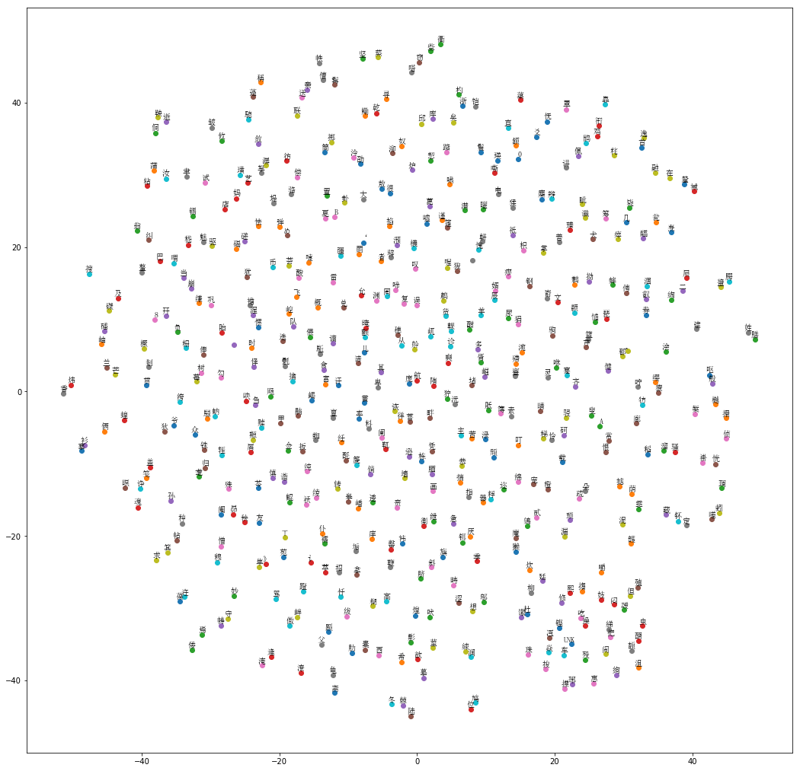

# Report of Week 10 homework

## Word Embedding

Based on the supported code I made the following changes to make the word embedding for QuanSongCi

~~~python
file = open('QuanSongCi.txt',encoding="utf8")
dataTotal = file.read()
chars = list(set(dataTotal))
data_size, num_classes = len(dataTotal), len(chars)
words = chars
~~~

 This will read the data from QuanSongCi.txt and make each of the word inside the text file unique and determine the number of class in the text as well.

As Chinese 1 char is equal to 1 word, therefore words = chars in the end.

~~~~python
vocabulary_size = 5000
~~~~

In this task we set and allow only 5000 different words even there are actually more than 6000 unique words in the text. So words that is not common will be put into the category of UNK through the build_dataset function;

~~~~python
batch_size = 128
embedding_size = 128 # Dimension of the embedding vector.
skip_window = 1 # How many words to consider left and right.
num_skips = 2 # How many times to reuse an input to generate a label.
~~~~

These parameter will determine the details of word embedding. Embedding_size of 128 means that each word will have a representation in 128 dimensions. In the space of 128 dimension, the word will have it's own position.

```python
data: ['搊', '坚', '彷', '駈', '谪', '骍', '屼', '咻']

with num_skips = 2 and skip_window = 1:
    batch: ['坚', '坚', '彷', '彷', '駈', '駈', '谪', '谪']
    labels: ['彷', '搊', '坚', '駈', '彷', '谪', '骍', '駈']

with num_skips = 4 and skip_window = 2:
    batch: ['彷', '彷', '彷', '彷', '駈', '駈', '駈', '駈']
    labels: ['谪', '駈', '坚', '搊', '彷', '谪', '坚', '骍']
```

This explained the meaning of  num_skips and skip_window.  num_skips determines how many times to reuse an input to generate a label. The skip_window determines how many words to consider left and right.

~~~~python
from sklearn.manifold import TSNE
  import matplotlib.pyplot as plt

  tsne = TSNE(perplexity=30, n_components=2, init='pca', n_iter=5000, method='exact')
  plot_only = 500
  low_dim_embs = tsne.fit_transform(final_embeddings[:plot_only, :])
  labels = [reverse_dictionary[i] for i in xrange(plot_only)]
  plot_with_labels(low_dim_embs, labels, os.path.join(gettempdir(), 'tsne.png'))
except ImportError as ex:
  print('Please install sklearn, matplotlib, and scipy to show embeddings.')
  print(ex)
~~~~

In the end, use TSNE method to lower the dimension from 128 to 2. So that we can see the distribution of words on X and Y coordinate (2 dimension). The similar related words are placed at the similar position of the graph as follow:




The Details of code are shown in Word Embedding.ipynb of the repository


## RNN-LSTM

代码请使用本作业提供的代码。学员需要实现RNN网络部分,RNN数据处理部分和RNN训练部分。

- train.py 训练
- utils.py 数据处理
- model.py 网络

##### Code modification for train.py:

~~~~python
    for x in range(1):
        logging.debug('epoch [{0}]....'.format(x))
        state = sess.run(model.state_tensor)
        ######################
        # My Code start here #
        ######################

        for step, (x,y) in enumerate (utils.get_train_data(vocabulary, batch_size=FLAGS.batch_size, num_steps=FLAGS.num_steps)):
            feed_dict = {model.X: x, model.Y: y,model.state_tensor:state, model.keep_prob: 0.9}

        ######################
        # My Code end here #
        ######################
            gs, _, state, l, summary_string = sess.run(
                [model.global_step, model.optimizer, model.outputs_state_tensor, model.loss, model.merged_summary_op], feed_dict=feed_dict)
            summary_string_writer.add_summary(summary_string, gs)

            if gs % 10 == 0:
                logging.debug('step [{0}] loss [{1}]'.format(gs, l))
                save_path = saver.save(sess, os.path.join(
                    FLAGS.output_dir, "model.ckpt"), global_step=gs)
    summary_string_writer.close()

~~~~

Use utils.get_trian_data() to generate data for each epoch of training. Each epoch construct of many batches. Each batch will feed data into the RNN training. Each batch of data contains of X and Y. Where X is the input of word and Y is the prediction of the X. Each epoch will refresh the initial state which is assigned to model's state_tensor variable. For this training, I set the keep_prob to 0.9 this will perform the drop out in the later training.

##### Code Modification for utils.py

~~~~python
def get_train_data(vocabulary, batch_size, num_steps):
    data, count, dictionary, reverse_dictionary = build_dataset(vocabulary, 5000)
    raw_y = data[1:]
    raw_x = data
    raw_y.append(len(vocabulary)-1)

    data_size = len(data)
    print('data Size size', data_size)
    data_partition_size = data_size // batch_size
    print('data partition size', data_partition_size)

    data_x = np.zeros([batch_size, data_partition_size], dtype=np.int32)
    data_y = np.zeros([batch_size, data_partition_size], dtype=np.int32)

    for i in range(batch_size):
        data_x[i] = raw_x[data_partition_size * i:data_partition_size * (i + 1)]
        data_y[i] = raw_y[data_partition_size * i:data_partition_size * (i + 1)]
    epoch_size  = data_partition_size // num_steps
    for i in range(epoch_size):
        x = data_x[:, i * num_steps:(i + 1) * num_steps]
        y = data_y[:, i * num_steps:(i + 1) * num_steps]
        yield (x,y)

~~~~

Using the existing build_dataset to turn the vocabulary into 5000 most common ones and leave the uncommon one to a category of UNK. The input of training data will be raw_x and the ground truth of the data will be raw_y. The ground truth for each of the word is just the next word of the raw data. So we can see if RNN gave the right word by comparing with the ground truth.

Then we make a partition of the data based on the batch size. In this training, the batch_size is 3 as the default value set in the system.This will make 634357 partitions of the data based on data size of 1903073. For each partition of the data it will retrieve batch_size amount of data. Then based on how many time step value are there (num_step), it will give 634357 / 32 = 19823 steps for 1 epoch.

*PS: In the document it states 19220 rather than 19820. So I'm just wondering where I got wrong here?*

##### Code Modification for train.py

~~~~python
        with tf.variable_scope('rnn'):
            state_size = self.dim_embedding
            def make_cell():
                cell = tf.nn.rnn_cell.BasicLSTMCell(state_size, forget_bias=0.0, state_is_tuple=True)
                cell = tf.nn.rnn_cell.DropoutWrapper(cell, output_keep_prob=self.keep_prob)
                return cell

            stacked_lstm = tf.contrib.rnn.MultiRNNCell([make_cell() for _ in range(self.rnn_layers)])
            self.state_tensor = stacked_lstm.zero_state(self.batch_size, tf.float32)
            outputs_tensor, self.outputs_state_tensor = tf.nn.dynamic_rnn(stacked_lstm, data, initial_state=self.state_tensor)

        # concate every time step
        seq_output = tf.concat(outputs_tensor, 1)

        # flatten it
        seq_output_final = tf.reshape(seq_output, [-1, self.dim_embedding])

        with tf.variable_scope('softmax'):
            softmax_w = tf.get_variable("softmax_w", [state_size, self.num_words], initializer=tf.random_normal_initializer(stddev=0.01))
            softmax_b = tf.get_variable("softmax_b", [self.num_words], initializer=tf.constant_initializer(0.0))
            logits = tf.matmul(seq_output_final, softmax_w) + softmax_b
~~~~

RNN scope:

Each of the RNN cell is made up with two parts. The first part is making a BasicLSTMCell through Tensorflow. The state_size is just the dimension of the embedding which is 128. The second part is the drop for this cell.

Then based on the parameter of rnn_layers (3 here). This will stack up multiple RNN Cells by using MultiRnnCell. The initial state tensor is initial through zero_state.

the outputs tensor is calculated by using dynamic_rnn. In this training, it should give a [3,32,128] tensor [batch_size, num_steps, state_size].

Softmax scope:
The softmax should be a [state_size, num_words]. This should be a [128, 5000] tensor. This produce the by using the matmul in the end with mx+b. m is the [128,5000] tensor, the x is the output tensor of rnn cells. 


The log of running is shown below:

~~~~python
################    eval    ################
2018-02-25 22:23:24.264038: I tensorflow/stream_executor/cuda/cuda_gpu_executor.cc:892] successful NUMA node read from SysFS had negative value (-1), but there must be at least one NUMA node, so returning NUMA node zero
2018-02-25 22:23:24.264363: I tensorflow/core/common_runtime/gpu/gpu_device.cc:1030] Found device 0 with properties: 
name: Tesla K80 major: 3 minor: 7 memoryClockRate(GHz): 0.8235
pciBusID: 0000:00:04.0
totalMemory: 11.17GiB freeMemory: 11.09GiB
2018-02-25 22:23:24.264405: I tensorflow/core/common_runtime/gpu/gpu_device.cc:1120] Creating TensorFlow device (/device:GPU:0) -> (device: 0, name: Tesla K80, pci bus id: 0000:00:04.0, compute capability: 3.7)
2018-02-25 22:23:24,968 - DEBUG - sample.py:41 - Initialized
INFO:tensorflow:Restoring parameters from /output/model.ckpt-99100
2018-02-25 22:23:24,972 - INFO - tf_logging.py:82 - Restoring parameters from /output/model.ckpt-99100
2018-02-25 22:23:25,020 - DEBUG - sample.py:46 - restore from [/output/model.ckpt-99100]
2018-02-25 22:23:25,395 - DEBUG - sample.py:81 - ==============[\u6c5f\u795e\u5b50]==============
2018-02-25 22:23:25,396 - DEBUG - sample.py:82 - \u6c5f\u795e\u5b50\u9785\u7eb4\u9785\u6c5d\u5f77\u9785\u7eb4\u6273\u59d7\u640a\u575a\u575a\u575a\u575a\u575a\u575a\u595a\u97ad\u575a\u575a\u4e8c\u9191\u72fb\u7b52\u5c7c\u7fc1\u595a\u82f4\u723b\u575a\u575a\u9785\u7eb4\u9785\u6c5d\u590d\u5f77\u9785\u7eb4\u9785\u822a\u98df\u640a\u9785\u9ec9\u9785\u7eb4\u5f77\u9785\u7eb4\u9785\u7eb4\u9785\u6c5d\u98df\u640a\u9785\u7eb4\u9785\u6c5d\u9a8d\u5b59\u5f77\u9785
2018-02-25 22:23:25,611 - DEBUG - sample.py:81 - ==============[\u8776\u604b\u82b1]==============
2018-02-25 22:23:25,611 - DEBUG - sample.py:82 - \u8776\u604b\u82b1\u9785\u7eb4\u895c\u640a\u575a\u575a\u575a\u575a\u575a\u575a\u595a\u97ad\u575a\u575a\u4e8c\u9191\u72fb\u7b52\u5c7c\u7fc1\u595a\u82f4\u723b\u575a\u575a\u9785\u7eb4\u9785\u6c5d\u590d\u5f77\u9785\u7eb4\u9785\u822a\u98df\u640a\u9785\u9ec9\u9785\u7eb4\u5f77\u9785\u7eb4\u9785\u7eb4\u9785\u6c5d\u98df\u640a\u9785\u7eb4\u9785\u6c5d\u9a8d\u5b59\u5f77\u9785\u7eb4\u9785\u6c5d\u5d93\u8393\u5f77
2018-02-25 22:23:25,830 - DEBUG - sample.py:81 - ==============[\u6e14\u5bb6\u50b2]==============
2018-02-25 22:23:25,830 - DEBUG - sample.py:82 - \u6e14\u5bb6\u50b2\u55df\u640a\u9785\u7eb4\u9785\u6c5d\u5f77\u9785\u7eb4\u655b\ue407\u5f77\u9785\u7eb4\u655b\ue407\u640a\u575a\u575a\u575a\u575a\u575a\u575a\u595a\u97ad\u575a\u575a\u4e8c\u9191\u72fb\u7b52\u5c7c\u7fc1\u595a\u82f4\u723b\u575a\u575a\u9785\u7eb4\u9785\u6c5d\u590d\u5f77\u9785\u7eb4\u9785\u822a\u98df\u640a\u9785\u9ec9\u9785\u7eb4\u5f77\u9785\u7eb4\u9785\u7eb4\u9785\u6c5d\u98df\u640a\u9785

~~~~

The unicode is shown on the log of TinyMind.